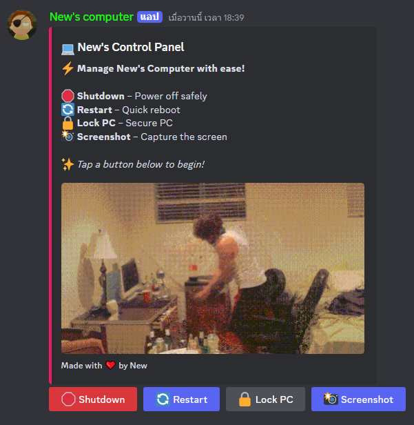

# Discord Com Control

Discord Com Control is a Discord bot that allows you to remotely control your computer through Discord commands. You can shut down, restart, lock your PC, and take screenshots using this bot.

## Features

- **Shutdown**: Power off your computer safely.
- **Restart**: Reboot your computer quickly.
- **Lock PC**: Secure your PC by locking it.
- **Screenshot**: Capture the screen and send the screenshot to Discord.

## Requirements

- Python 3.10+
- `discord.py`
- `pyautogui`
- `pillow`
- `python-dotenv`

## Installation

1. Clone the repository:
    ```sh
    git clone https://github.com/newnonsick/Discord-Com-Control.git
    cd Discord-Com-Control
    ```

2. Create a virtual environment and activate it:
    ```sh
    python -m venv venv
    source venv/bin/activate  # On Windows, use `venv\Scripts\activate`
    ```

3. Install the required packages:
    ```sh
    pip install -r requirements.txt
    ```

4. Create a .env file in the root directory and add your Discord bot token:
    ```env
    BOT_TOKEN=your-bot-token
    ```

## Usage

### Manual Run

1. Run the bot:
    ```sh
    python main.py
    ```

2. Use the `/setup` command in a Discord text channel to set up the control panel.

3. Use the buttons in the control panel to shut down, restart, lock your PC, or take a screenshot.

### Automatic Run on Startup

1. Create a batch file `run.bat` with the following content:
    ```bat
    @echo off
    cd /d "<PATH_TO_YOUR_BOT>"
    python main.py
    exit
    ```

2. Press `Win + R`, type `shell:startup`, and press Enter. This will open the Startup folder.

3. Place the `run.bat` file in the Startup folder. The bot will now run automatically when your computer starts.

## Preview


